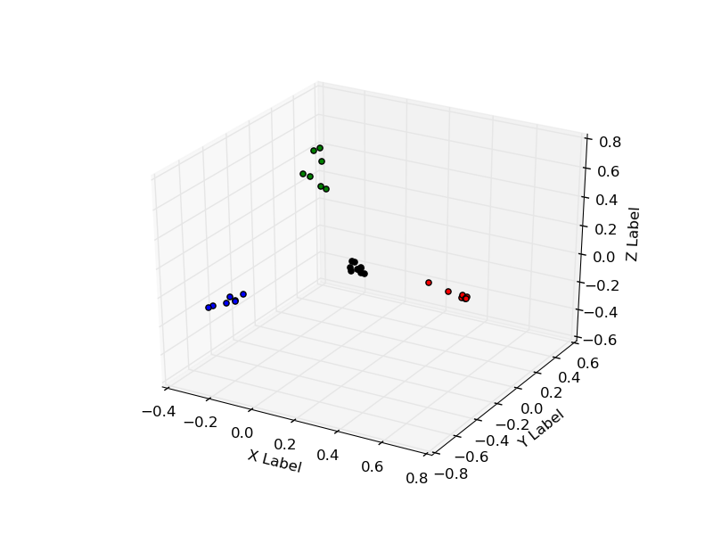

# Análisis de corpus de notas

Exploración de diferentes técnicas para detectar tópicos en un corpus de notas

## Descripción de notas

Cada texto es descripto como un vector numérico en un espacio de **keywords**  extraídas del mismo corpus. El corpus queda entonces representado como un conjunto de puntos en un espacio mutidimensional.

#### Extracción de keywords: tf-idf

La técnica **tfidf** rankea todos los términos del corpus en función de su representatividad en cada nota. Es decir, penaliza aquellos términos que aparecen en distintos textos (términos comunes) y resalta los más distintivos a la hora de describir un texto (términos propios de unos pocos textos).

Una vez definido el espacio en el espacio de los términos, los textos se convertirán en vectores donde cada componente será la valorización de cada término pesado por la frecuencia de aparición de dicho término en el texto dado.

##### Idf
La valorización de un dado término se calcula como:
$$ idf(t) = 1 + log(\frac{1 + N}{1 + n_t})$$

donde \(N\) es el número total de textos en el corpus, \(n_t\) es la cantidad de textos donde aparece el término \(t\). Así cuanto más alto sea \(n_t\), más bajo será \(idf(t)\).

##### Representación de los textos en forma vectorial
Si el corpus constara de dos términos, llamemoslos **a** y **b**, y uno de los textos sea "**a**,**a**,**b**", la representación vectorial será:
$$ t = (2[idf(a)], 1[idf(b)]) $$  

es decir, cada término está pesado por la cantidad de apariciones de cada término en el texto.

##### Implementación en python
La librería **sklearn** provee las herramientas para realizar esta descripción. Sea **texts** una lista cuyos elementos son los textos del corpus.

En primer lugar debemos extraer los **keywords** y definir el espacio multidimensional. Ello se realiza con **CountVectorizer**:
```python
class sklearn.feature_extraction.text.CountVectorizer(input=u'content', encoding=u'utf-8', decode_error=u'strict', \
strip_accents=None, lowercase=True, preprocessor=None, tokenizer=None, \
stop_words=None, token_pattern=u'(?u)\b\w\w+\b', ngram_range=(1, 1), \
analyzer=u'word', max_df=1.0, min_df=1, max_features=None, \
vocabulary=None, binary=False, dtype=<type 'numpy.int64'>)
```
Dentro de los argumentos más relevantes se encuentran:

- **stop_words**: podemos pasarle una lista de conectores o palabras comunes, las cuales ignore.
- **ngram_range**: los términos pueden ser palabras sueltas o bien bigrams, trigrams, etc. Tomará los n-grams contenidos en dicha lista.
- **max_features**: importante! Limita la cantidad de dimensiones a usar, ordenadas de mayor a menor según la cantidad de veces de aparición en el corpus.
- **min_df**: límite inferior a la frecuencia de aparición de un término en el documento. Permite eliminar los términos muy poco frecuentes. Si el número es entero, índica la mínima cantidad de documentos en los que tendría que aparecer, y si es un flotante entre 0 y 1, indica la mínima frecuencia de aparición.
- **max_df**: idem **min_df**, salvo que es una cota superior a la aparición de términos. Permite eliminar términos muy frecuentes que no ayudan a distinguir a un documento de otro.

Un ejemplo de aplicación sobre **texts** será:

```python
import sklearn.feature_extraction.text import CountVectorizer

count_vect = CountVectorizer()
x_counts = count_vect.fit_transform(texts)
```

**x_counts** es ahora una sparse-matrix donde los textos están representados en el espacio de términos extraídos, y cada componente es la cantidad de apariciones de un dado término en el texto. Aún no se aplicó **tf-idf**.
Para ver el vocabulario extraído se aplica:

```python
print count_vect.vocabulary_
```

y para ver la matriz en explícitamente:

```python
print x_count.toarray()
```

Ahora sí se procede a realizar el cálculo tf-idf. Ello se realiza con:
```python
class sklearn.feature_extraction.text.TfidfTransformer(norm=u'l2', use_idf=True, smooth_idf=True, sublinear_tf=False)
```
La opción **smooth_idf=True** aplica la fórmula expresada anteriormente. 

La opción **norm** normaliza los vectores resultantes a norma 1 (euclideana), es decir, los textos son vectores dentro de la circunsferencia. **norm=None** devuelve los vectores con la representación **tf-idf** explicitamente.

La aplicación en **x_count** sería:

```python
import sklearn.feature_extraction.text import TfidfTransformer

tfidf_transformer = TfidfTransformer()
x_tfidf = tfidf_transformer.fit_transform(X_counts)
```

donde **x_tfidf** es la matrix de textos en su presentación **tf-idf** (en este caso normalizada).

## Ranking de términos en cada texto

Si se quiere ordenar los términos por valorización **tfidf** se puede proceder de la siguiente manera:

```python
features_names = count_vect.get_feature_names()

names_tfidf = sorted([[features_names[i], x_tfidf[number_of_doc,i]] \
                for i in range(len(features_names))], \
                key = lambda x: x[1], reverse = True)
```

**features_names** son todos los términos tomados y **x_tfidf** es una matrix _sparse_ cuyo primer índice (se accede por corchetes **x[,]**) es el número del documento y el segundo el índice asociado con el término. Esta matrix contiene la valorización para todo documento sobre todo término.
            


## Detección de tópicos

Una vez descripto el corpus numéricamente, aquí se presenta el problema de cuál es la mejor representación del problema a fin de detectar la separación en tópicos que a priori sabemos que existe.
Aquí tenemos dos grandes enfoques: 

- la representación de las notas como nodos de una red compleja, transfomando el problema de detección de tópicos en un problema de detección de comunas en la red.
- la representación vectorial, entendiendo las notas como puntos en un espacio multidimensional, y el problema de tópicos como busqueda de clusters en dicho espacio.

#### Redes complejas

Uno de los posibles enfoques para transformar el corpus en una red compleja es considerar que el mismo se trata de una red completa, con links pesados, donde el peso de los links viene dado por la similaridad entre notas.

Podemos definir similaridad de diferentes maneras:

- \( sim(i,j) = v_i . v_j = cos(\theta) \), donde el producto es el producto escalar entre los vectores de las notas \( i \) y \( j \), que es igual al coseno del ángulo que forman entre ellos. Los vectores tienen que estar debidamentes normalizados, y la similaridad es un número real entre \( 0 \) y \( 1 \).
- \( \frac{1}{1 + d_{ij}} \): donde \( d_{ij} \) es la distancia entre vectores, normalizados o no. Esta similaridad también estará acotada entre \( 0 \) y \( 1 \). Buscar la definición de distancia más apropiada.
- Si se piensa como una red bipartita entre las notas y los términos, el peso de los links entre notas viene dado por la proyección al espacio de notas, es decir, \( v_i . v_j \) pero sin normalizar los vectores. 

Pensarlo como una red bipartita en principio parece funcionar bastante bien, aunque hay que ver algunas definiciones, como ejemplo que el peso entre dos notas perfectamente similares puede ser menor que dos diferentes.


###### Construcción de la red a partir de la matriz de adyacencia

Con el paquete **igraph** creamos la red con:
```python
import igraph

# Matriz numpy simétrica: weighted_matrix = np.array(dtype = np.float)

graph = igraph.Graph.Weighted_Adjacency(list(weighted_matrix), mode = igraph.ADJ_MAX)
```

###### Detección de comunidades con igraph

Aunque depende del algoritmo en cuestión, por ejemplo, con **infomap** se calcula:
```python
membership = graph.community_infomap(weights = weights)
```

donde **membership** contiene la información de a qué comuna pertenece cada nodo.
Si el algoritmo devuelve un objeto **VertexClustering** entonces:

```python
clust = graph.community_something(weights = weights)
membership = clust.as_clustering()
```


#### Kmeans

En vez de encarar el problema tratando de construir un grafo de noticias, se puede realizar un análisis de clustering, es decir, pensar las notas como puntos en un espacio multidimensional y realizar clustering, agrupamiento de notas. Al realizar clustering es conveniente que los vectores que surjan de **tfidf** estén normalizados.

El análisis de **Kmeans** se puede complementar con **PCA**, lo cual reduce la dimensionalidad de los puntos, encontrando una combinación lineal de dimensiones.

La evaluación de las particiones propuestas se puede realizar con el coeficiente de _silhouette_.

Ejemplo de código:

```python

# Enfoque con PCA y Kmeans

from sklearn.decomposition import PCA
from sklearn.cluster import KMeans
from sklearn.metrics import silhouette_score as sil_score

ans = []

for dim in range(2, 10):

    pca = PCA(n_components = dim)
    x_red = pca.fit_transform(x_tfidf.toarray())

    for clusters in range(2, 10):

        km = KMeans(n_clusters = clusters, n_init = 100, n_jobs = -1).fit(x_red)

        ans.append([dim, clusters, sil_score(x_red, km.labels_)])


ans_sorted = sorted(ans, key = lambda x: x[2], reverse = True)
print ans_sorted[:20]
```

El código anterior devuelve los primeros 20 resultados con el mayor coeficiente de _silhouette_.
En un ejemplo con 4 tópicos, se halló que tres dimensiones es suficiente para una buena descripción,
como puede verse en la figura:
<center>  </center>


